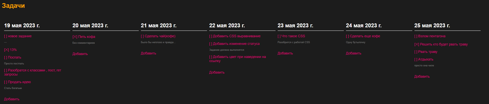
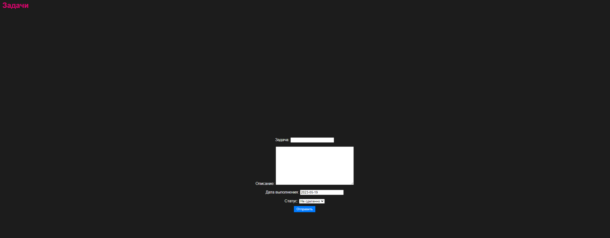
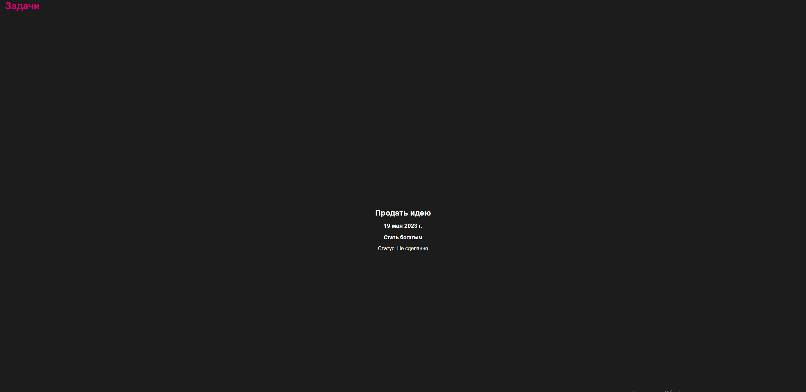

# Первый README

К этому празднику я написал бесполезный **To_Do_шник**, без подключения SMTP, даже без телеграма и даже скажу больше без 
возможности помечать как "_Выполненное_" задание. Но зато с душой, с тренировочным умыслом.

19.05.2023
А еще не было идеи как этот todoшник оформить правильно, так что он просто разбит на 7 частей, 1 день это текущий 
остальные последующие от него.

Ко всему прочему тут нет работы с пользователем, никакой аутентификации и авторизации. Кто-то назовет "нелепо"
, я же скажу "Эксклюзивно" (нет)

П.С. В этой работе я смешал давно утраченные стили html 2000-х и смешал это с минимализмом 2022. Хипстеры будут довольны,
я буду купаться в деньгах.

>[!info]- (Это все несерьезный проект, а практика).
Да, практика на Django
